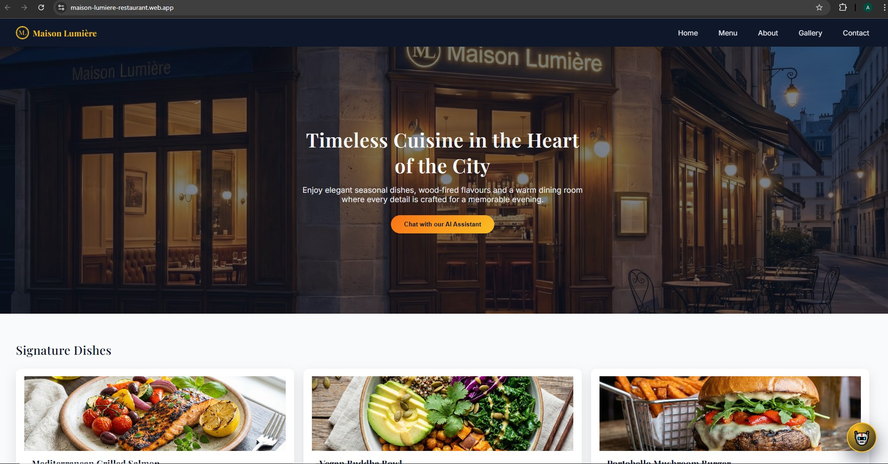
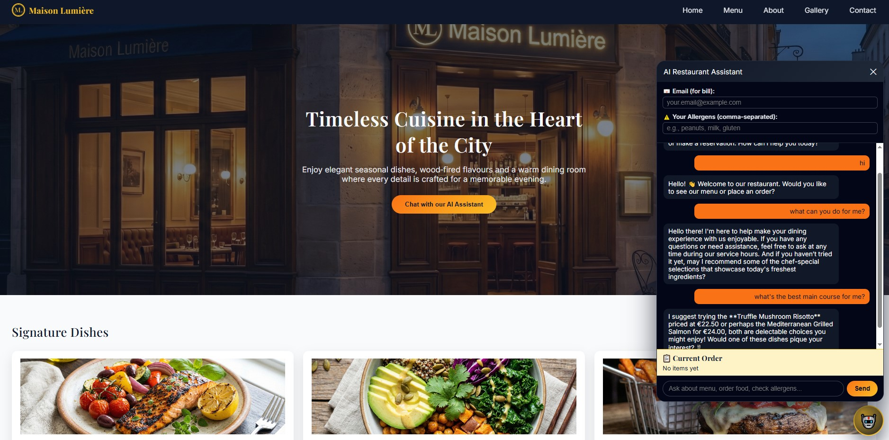
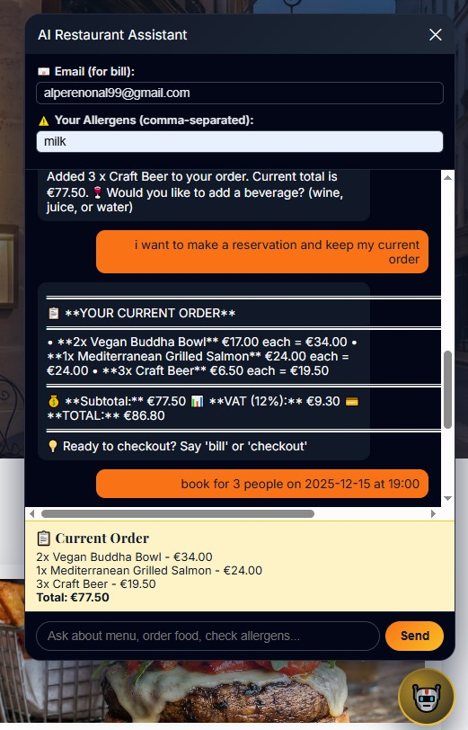
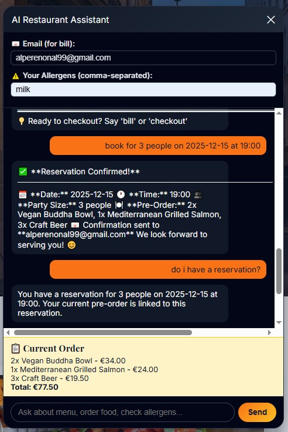
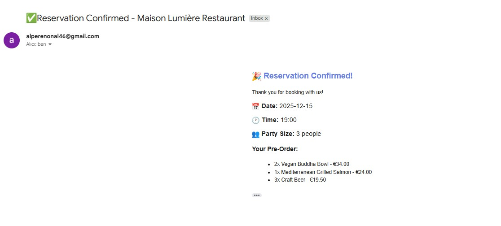

# Maison Lumière – AI Restaurant Assistant 🍽️

**Maison Lumière** is a web-based restaurant assistant that helps guests browse the menu, ask questions, and place orders through a natural language chat interface. It combines a modern frontend with an AI-powered backend that understands free‑text requests and turns them into structured orders.

> **Note:** In the current setup, the frontend is deployed online, while the backend is run locally during demos due to model and resource constraints.

## Table of Contents
- [Project Overview](#project-overview)
- [Key Features](#key-features)
- [Architecture](#architecture)
- [Tech Stack](#tech-stack)
- [Screenshots](#screenshots)
- [Getting Started](#getting-started)
- [How It Works](#how-it-works)
- [Project Structure](#project-structure)
- [Limitations and Future Work](#limitations-and-future-work)


---

## Project Overview 📖
Traditional restaurant websites are static: they show a menu, a phone number, and maybe an online form, but customers still have to interpret everything themselves. **Maison Lumière** explores how an AI assistant can guide guests through the menu, answer questions, and build an accurate order in a conversational way.

The system provides a chat interface where users can type messages like *“I’m vegan, what do you recommend?”* or *“Two margherita pizzas and one tiramisu to take away at 19:30”*, and the assistant extracts order details and maps them to the restaurant’s structured menu. The focus is on user experience, clarity of orders for the kitchen, and on demonstrating how LLMs can be integrated into a realistic restaurant workflow.

## Key Features ✨
* **Conversational ordering:** Guests can place and update orders using natural language instead of rigid forms.
* **Menu-aware assistant:** The AI works with a predefined menu, validates items, and requests clarification when needed.
* **Order summary and confirmation:** Before “sending” an order, the assistant presents a clear, structured summary the customer can review.
* **Web-based UI:** A responsive single‑page frontend that runs in any modern browser and is deployed on Firebase Hosting.
* **API-first backend (optional deployment):** A FastAPI backend that exposes REST endpoints for chat, menu retrieval, and order handling, currently run locally during demos.

## Architecture 🏗️
At a high level, Maison Lumière is split into two parts:

### Frontend
* Static web app (HTML/CSS/JavaScript) served from Firebase Hosting.
* Provides the chat interface, menu display, and order summary views.
* Communicates with the backend over HTTP (JSON).

### Backend
* FastAPI application that exposes endpoints such as `/chat`, `/menu`, and `/orders`.
* Uses an embedding model and simple retrieval to ground the assistant in the restaurant’s menu and business rules.
* Currently executed locally (e.g., on the developer’s machine) due to RAM requirements of the model.

**A typical interaction is:**
1.  User sends a message in the browser.
2.  Frontend calls the FastAPI `/chat` endpoint with the message and current conversation state.
3.  Backend uses the menu data plus an LLM to interpret the request and update the order.
4.  Backend returns a response message and structured order details, which the frontend renders.

## Tech Stack 💻

**Frontend**
* HTML, CSS, Vanilla JavaScript
* Firebase Hosting for deployment

**Backend**
* Python, FastAPI, Uvicorn / Gunicorn
* Vector/embedding model for menu understanding (run locally)

**Tooling**
* Git & GitHub for version control
* Azure CLI (used during deployment experiments)

## Screenshots 📸


*Landing page of the restaurant site*


*Chat assistant taking an order*


*Final structured order summary*


*Reservation*


*Reservation Confirmed email has been sent*

---

## Getting Started 🚀
This section explains how to run the project locally from scratch.

### Prerequisites
* Git
* Python 3.10+
* Node.js (optional, only if you want extra tooling for the frontend)
* Firebase CLI (for local hosting / redeploying the frontend)

### Backend Setup (Local)
1.  **Clone the repository**
    ```bash
    git clone https://github.com/alperen4066/Restaurant_Management_Assistant.git
    cd maison-lumiere/restaurant-assistant/backend
    ```

2.  **Create and activate a virtual environment**
    ```bash
    python -m venv .venv
    # macOS / Linux
    source .venv/bin/activate
    # Windows
    .venv\Scripts\activate
    ```

3.  **Install dependencies**
    ```bash
    pip install -r requirements.txt
    ```

4.  **Run the development server**
    ```bash
    uvicorn main:app --host 0.0.0.0 --port 8000 --reload
    ```
    Open the auto‑generated API docs at: `http://localhost:8000/docs`

### Frontend Setup
1.  **Navigate to the frontend folder**
    In another terminal:
    ```bash
    cd maison-lumiere/restaurant-assistant/frontend
    ```

2.  **Configure API URL**
    If you want the frontend to talk to a local backend, set `API_URL` in your JavaScript config (e.g., `app.js`) to:
    ```javascript
    const API_URL = "http://localhost:8000";
    ```

3.  **Run a simple local server**
    ```bash
    # Example using Python
    python -m http.server 5173
    ```

4.  **Access the App**
    Visit the site in your browser (e.g., `http://localhost:5173`) and start chatting with the assistant.

    *For production deployment:*
    ```bash
    firebase deploy
    ```
    *This publishes the static frontend, while the backend remains a local service during demos.*

## How It Works 🧠
The menu and restaurant policies are represented as structured data (JSON / Python models).

When the user sends a message, the backend:
1.  **Embeds** the text and compares it to menu items to detect dishes and options.
2.  **Uses an LLM prompt** that describes the restaurant, menu, and ordering rules (e.g., opening hours, delivery vs. pickup).
3.  **Produces** both a natural language answer and a structured “order state” object containing guests, items, quantities, and notes.

The frontend renders the assistant’s reply and keeps an up‑to‑date, human‑readable order summary as the conversation progresses. This design keeps the assistant grounded in the actual menu and helps avoid hallucinated dishes or impossible requests.

## Project Structure 📂
Adapt the paths if your repo is slightly different.

```text
maison-lumiere/
├── restaurant-assistant/
│   ├── backend/
│   │   ├── main.py          # FastAPI application entrypoint
│   │   ├── models/          # Pydantic models for menu, order, etc.
│   │   ├── services/        # Chat, menu, and order logic
│   │   ├── data/
│   │   │   └── menu.json    # Restaurant menu and metadata
│   │   └── requirements.txt
│   └── frontend/
│       ├── index.html
│       ├── styles.css
│       ├── app.js           # Chat UI and API integration
│       └── firebase.json    # Firebase Hosting configuration
└── README.md

---

## Limitations and Future Work

- **Backend hosting** – Currently, the backend is not deployed to the cloud due to RAM limits of free tiers and the embedding model. A future iteration could:
  - Use a lighter external embedding API or smaller model.  
  - Move to a more powerful app service plan or container platform. [web:139]

- **Authentication and payments** – The project focuses on the ordering experience; payments and user accounts are out of scope but could be integrated later. [web:137]

- **Voice interface** – An extension could add speech‑to‑text and text‑to‑speech for fully hands‑free ordering. [web:134]


---
## 📄 License

This project is licensed under the MIT License - see the [LICENSE](LICENSE) file for details.
---